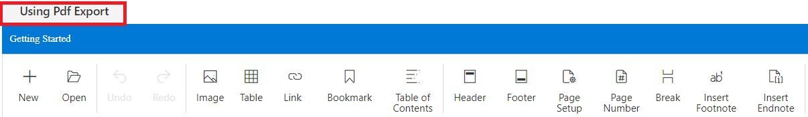
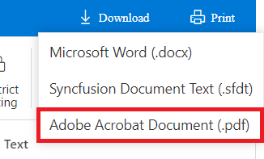

This folder contains demo illustrates exporting the document of Syncfusion Word Processor (Document editor) component as PDF in client side and server side.

## Client side export

Button above title bar allows you to export document as pdf using [`pdf-export-component`](https://www.npmjs.com/package/@syncfusion/ej2-pdf-export) in client side.

## Server side export

Download options in title bar allow you to export document as pdf with the help of [`Synfusion DocIO`](https://help.syncfusion.com/file-formats/docio/word-to-pdf) in server-side.

